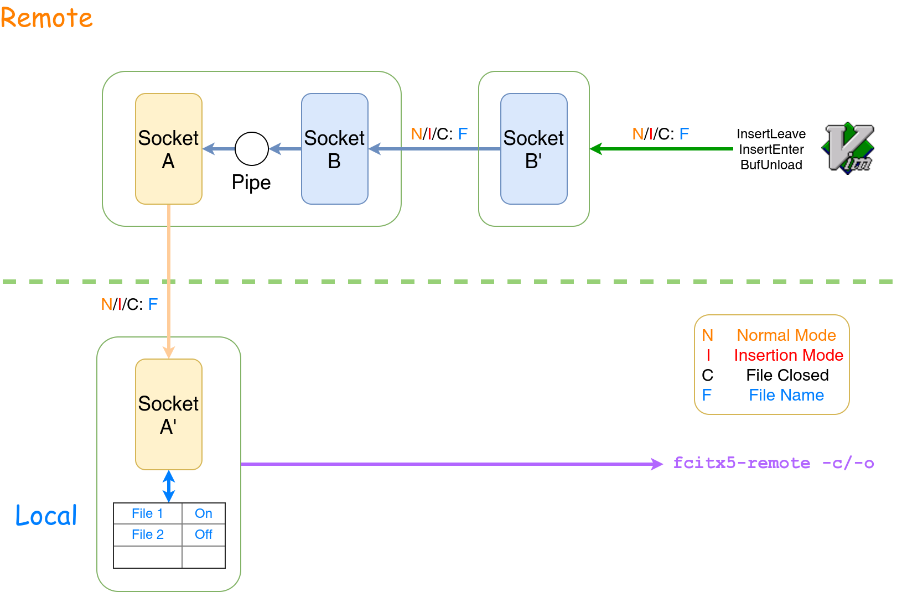

<!-- vimc: call SyntaxRange#Include("```sh", "```", "sh", "NonText"): -->

# ztools

Several gadgets for Linux.

## `target-pool`

Trick for target scheduling.

### Test Environment:

* GNU bash 4.4.19(1)-release
* Python 3.6.7
* Vi IMproved 8.0, with patch 1-1766

### Usage

* `target init` - initiate a target pool (`~/.target_pool`)
* `target edit` - edit the target pool
* `target plan` - edit the every-week plan (`~/.target_update_plan`)
* `target ddl` - edit the one-shot DDL-s (`~/.target_ddl`)
* `target update` - update the weights in the target pool in accordance with `~/.target_update_plan` and `~/.target_ddl`; this command will update the weights subject to a reciprocal function of the difference to the ddl
* `target select` - randomly select a target in accordance with the weights in the target pool
* `target list-ddls` - list the closest DDL-s in `~/.target_update_plan` and `~/.target_ddl`

### Configuration for Autocompletion

In order to configure `bash` to autocomplete the command names, add following statements to `~/.bashrc`.

```sh
function _target() {
	COMPREPLY=($(compgen -W "update edit init select plan ddl list-ddls" ${COMP_WORDS[$COMP_CWORD]}))
	return 0
}
complete -F _target target
```

### About the Structure of the Target Pool File

The target pool file is in the following form:

```
# target	weight
Read papers	3
Lab	4
Literary read	2
```

The lines starting with "#" will be considered as comments. The last field separated by white space characters is considered as the weight while the other fields are considered as the target name integrally.

### About the Structure of the Every-week Plan File

The plan file is in the following form:

```
# target	DDL (weekday)
Application for summer practice		4
Prepare for experiment 1
```

The lines starting with "#" will be considered as comments as well. The last field separated by white space characters is considered as the weekday of the periodic deadline of the particular target while the other fields are considered as the target name integrally as well.

### About the Structure of the One-shot DDL File

The ddl file is in the similar form with the pool file and the plan file:

```
# target	DDL (yyyy-mm-dd)
Big project of Intelligent Optimisation Algorithms	2019-6-13
Report of oral history requested for Mao Thought	2019-5-31
```

The difference is that the last field indicates the one-shot ddl of the corresponding target but not the weight or the periodic ddl.

## `remote-fcitx-vim`

An external extension like `fcitx.vim` plugin which helps to activate or deactivate `fcitx5` automatically on entering or leaving the insertion mode when you're using `vim` on a remote machine through `ssh`. This tool isn't plugged into `vim`, however, rather than `fcitx.vim` works as a plugin for `vim`. A daemon should be started on the remote machine. The client on the local machine connects to the remote daemon and receives the status of the remote `vim` from the daemon and switch the status of `fcitx5` accordingly.

### Test Environment

Local machine:

* Manjaro 20.1 Mikah
* x86_64 Linux 5.7.15-1-MANJARO
* KDE 5.73.0 / Plasma 5.19.4
* fcitx5 4.99.0
* Python 3.8.5
* openssh 8.3p1

Remote machine:

* Ubuntu 18.04 bionic
* x86_64 Linux 4.15.0-109-generic
* Vi IMproved 8.0, with patches 1-1453
* Python 3.6.9
* openssh-server 1:7.6p1

### Usage

After ssh-ing to the remote host, start the daemon. The daemon will be bound to `0.0.0.0:30002` by default. The default address and port could be modified by

```sh
python3 remote_fcitx_vim_daemon.py --address ADDRESS --port PORT &>>/dev/null &
```

Then launch the local client and connect to the remote daemon.

```sh
python3 remote_fcitx_vim_local_machine.py [--port REMOTE_PORT] REMOTE_ADDRESS &>>/dev/null &
```

Add the content in the `for_vimrc_on_server` to `~/.vimrc` and replace the value of `s:remote_fcitx_vim_path` with the path to `remote_fcitx_vim_sender.py`.

And you could use this extension now. Enjoy it!

### Resolution for the Remote Host behind an NAT

When the remote host is behind an NAT, maybe you cannot connect to the port used by the underlying daemon directly. In this case, you may need to configure a new port mapping on the remote gateway or traverse the NAT by some way.

If you have no idea to traverse the NAT or you don't want to install any additional software, here is an alternative solution. SSH2 protocol provides a simple forwarding and proxy function. Simply login to the remote machine with `-L` option:

```sh
ssh -L <local_port>:<daemon_address>:<daemon_port> -p <remote_port> remote_user@remote_host
```

The connection to the `<local_port>` will be forwarded to `<daemon_address>:<daemon_port>` automatically through the ssh connection. As for this extension, since the daemon is directly run on the ssh server, `<daemon_address>` could be simply set to `127.0.0.1`. `<daemon_address>` is the port the daemon listens to (`30002` by default).

For more details w.r.t. the usage of `ssh -L` and `ssh -R`, please refer to the man page of `ssh`.

### Implementation Scheme



Note that in the current version, unix domain socket is adopted for "Socket B" on the figure. It could be replaced by an internet socket so as to support the `fcitx` status management of multiple hosts with singular daemon.

## Shell Timestamper

Timestamp your standard output!

### Test Environment

+ x86_64 Linux 5.14.7-2-MANJARO
+ GNU bash，版本 5.1.8(1)-release (x86_64-pc-linux-gnu)
+ Python 3.9.7

### Usage

There are two ways to use the shell timestamper. One way is to wrap the target command with the `tstamp` instruction, just like the usage of `time` instruction in bash.

```sh
tstamp [--format FORMAT] [--buffer-mode BUFFER_MODE] -- command ...
```

Besides, `tstamp` could be appended behind the target command through a pipe, just like the usage of `tee`.

```sh
command ... |tstamp [--format FORMAT] [--buffer-mode BUFFER_MODE]
```

`--format` option could be abbreviated as `-f` and `--buffer-mode` - `-m`. `--format` controls the format of the timestamp. The format string complys the protocol in Python 3 `datetime` module and defaults to `%Y-%m-%d %H:%M:%S.%f`. `--buffer-mode` controls the buffer mode, for which two choices are availabe: `c` and `L`. `c` instructs the stamper to flush the buffer per character, or just say, use no buffer. `L` instructs the stamper to flush the buffer per line, which is the default behaviour for most command line programs. However, the default mode of stamper is set to `c` for the best support to the programs requiring standard inputs. If your program requires no user's input and the standard I/O performance is crucial, it is recommended to use the `L` mode.

## Version Tool

A simple tool helping manual version control.

### Test Environment

+ x86_64 Linux 5.15.25-1-MANJARO
+ GNU bash，版本 5.1.16(1)-release (x86_64-pc-linux-gnu)
+ Python 3.10.2

### Usage

```sh
version --help
```

```
usage: version [-h] {init,list,check,commit,checkout,log,export} ...

positional arguments:
  {init,list,check,commit,checkout,log,export}
    init                Initiate a version repository.
    list                List tracked files.
    check               Check the versions of a specific file.
    commit              Commit a file version.
    checkout            Checkout a file version
    log                 Print the daily log.
    export              Export the version table.

options:
  -h, --help            show this help message and exit
```

### Configuration for Autocompletion

```sh
function _complete_version() {
	local subcommands="init list check commit checkout log export"
	if [[ $COMP_CWORD -le 2 ]]; then
		COMPREPLY=($(compgen -W "$subcommands" ${COMP_WORDS[$COMP_CWORD]}))
	fi
}
complete -F _complete_version version
```

## Other Tiny Tools

* `~/.sogoubackup/backup` - backup the configs of Sogou Input Method routinely
* `convert_file_name` - convert the extension name of the images from the mobile from 'jpeg' to the correct one

## Useless Toys

### `simple-encryptor`

A simple encryption tool using XOR algorithm.

#### Test Environment:

* Python 3.6.7

#### Usage

```sh
encrypt --help
```

```
usage: encrypt [-h] [--password [PASSWORD]] [--decode] [--delete]
               [--recursive] [--suffix SUFFIX]
               input [input ...]

positional arguments:
  input                 The file to encrypt or decrypt

optional arguments:
  -h, --help            show this help message and exit
  --password [PASSWORD], -p [PASSWORD]
                        Indicates whether a password should be used
  --decode, -d          Decrypts the file if set
  --delete              Delete the inputed file if set
  --recursive, -r       Encrypt the files under the directory recursively if
                        set. With "--delete" option set implicitly
  --suffix SUFFIX, -a SUFFIX
                        Specify the suffix of the encrypted file. The suffix
                        will be appended to the inputed file name during
                        encryption and be truncated from the inputed file name
                        during decryption
```

### `base64decode`

Base64 decoder constructed in Python 3.

#### Test Environment:

* Python 3.6.7

#### Usage

```sh
base64decode --help
```

```
usage: base64decode [-h] [--decode DECODE] [--file FILE] [--encoding ENCODING]

optional arguments:
  -h, --help            show this help message and exit
  --decode DECODE, -d DECODE
                        Base64 string to be decoded
  --file FILE, -f FILE  Text file where stored Base64 string to be decoded; "-" for stdin; If either
                        this option or "--decode" isn't set, the coded string will be read from stdin
  --encoding ENCODING   Encoding of decoded string; Default to utf-8
```

# Custom Config Files

Now such config files as follows are collected in this repo:

* `~/.bashrc`
* `~/.profile`
* `~/.vimrc`
* `~/.tmux.conf`
* `~/.config/fcitx/data/punc-ng.mb.zh_CN`
* `~/.local/share/fcitx5/data/QuickPhrase.mb`(`~/.config/fcitx/data/QuickPhrase.mb`)
* `~/.config/htop/htoprc`
* `~/.gotop/layout`

Under directory `w3m`:

* `~/.w3m/keymap`

Under directory `terminator`:

* `~/.config/terminator/config`

# Custom Service Files

* `~/.config/systemd/user/rem_schedule.service` - for `remind` daemon
* `~/.config/systemd/user/remote-fcitx-daemon.service` - for `remote-fcitx-vim` daemon
